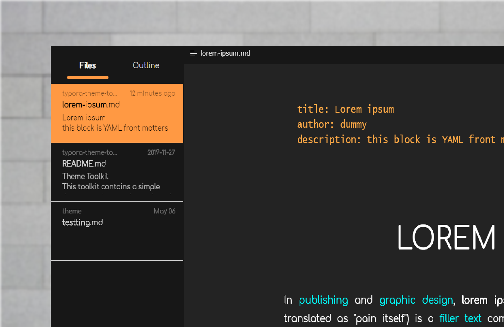

# Work In Progress

# Saffron theme for Typora
Created by Me

## Installation instructions
* Download the zipped project package.
* Copy the `saffron.css` file and `saffron` folder to your Typora theme library.
* Launch or restart Typora and choose `Saffron` from the theme menu.

### Creating a new file - splash screen

# Saffron Dark Theme

Not much design thinking is done.

Just used color combination that I like.

